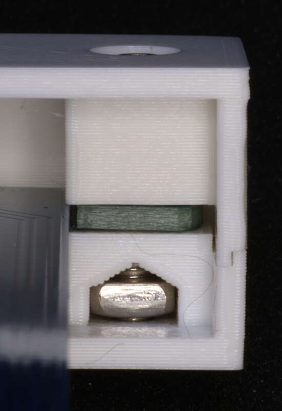
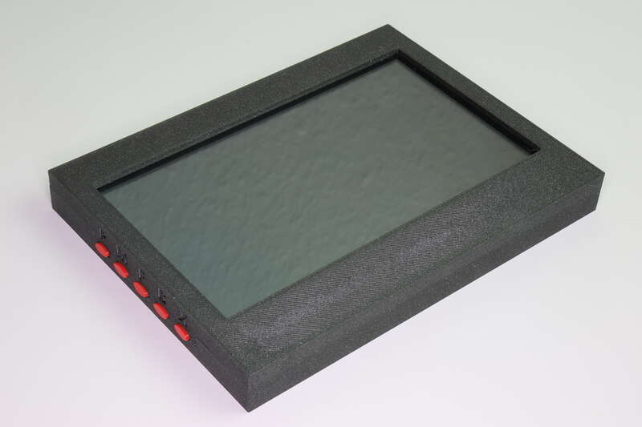

# Case for the Waveshare 7 inch IPS HDMI display with USB touch, audio and VGA connectors

  
*Explosion sketch*

Display case with holes for the connectors and buttons for the micro switches, held together by M3*16 screws/M3R nuts

## Overview

This model defines case for the Waveshare 7 inch display. It features

- minimum size around the display
- display is horizontally centered in the case
- knobs on the left side are pressed through buttons in the case
- buttons can be oval or rectangular
- connectors on the right side are accessible through seperate openings in the case

  
*Left side oval buttons*

  
*Left side rectangular buttons*

  
*Right side case openings*

The case consists of a top and bottom part and the five knobs.
Top and bottom part fit into each other using a surrounding notch.

  
*Notch on case part*

They are held together with four M3x16 screws and M3R rectangular nuts,
both nut heights fit. These screws also hold the display itself in place
and keep it between the two halfs of the case.

  
*Screw and nut holding the case together*

The case is printed without any supports. It uses 45° overhangs at the critical elements
which should be printed cleanly by any decent 3D printer. You might want to use 40% infill.

  
*Detail of oval left side button*

## Related projects

This design is also published on Printables where you can also find prerendered STL files.

* [Case with oval buttons](https://www.printables.com/model/1318542-case-for-the-waveshare-7-inch-ips-hdmi-display-wit)
* [Case with rectangular buttons](https://www.printables.com/model/1318554-case-for-the-waveshare-7-inch-ips-hdmi-display-wit)

  
*Case with display and oval buttons*

[← Back to project overview](../README.md)
